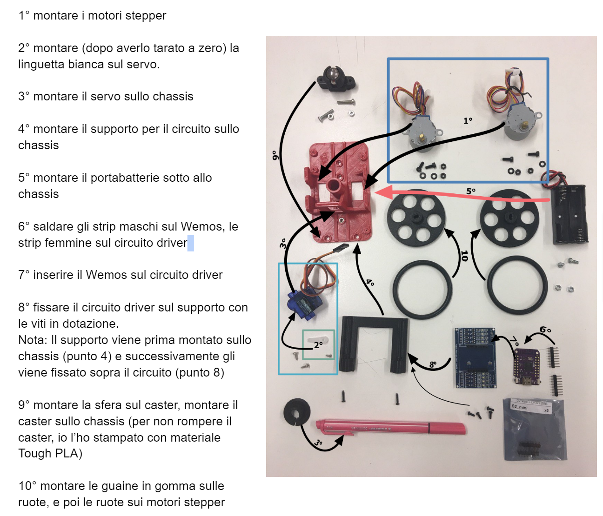
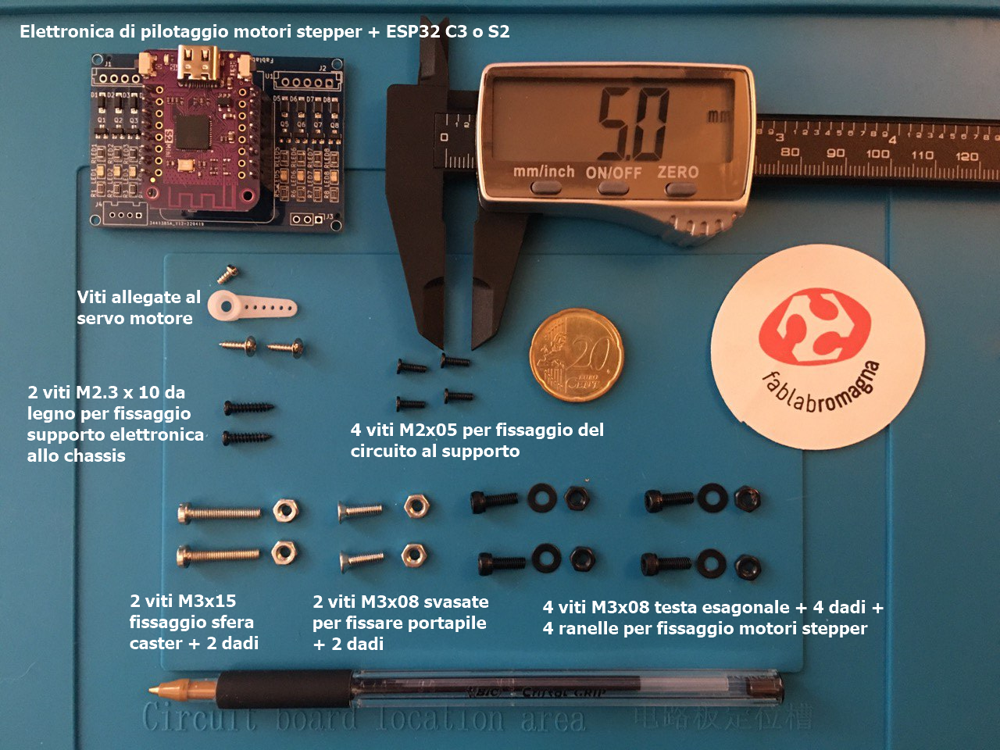
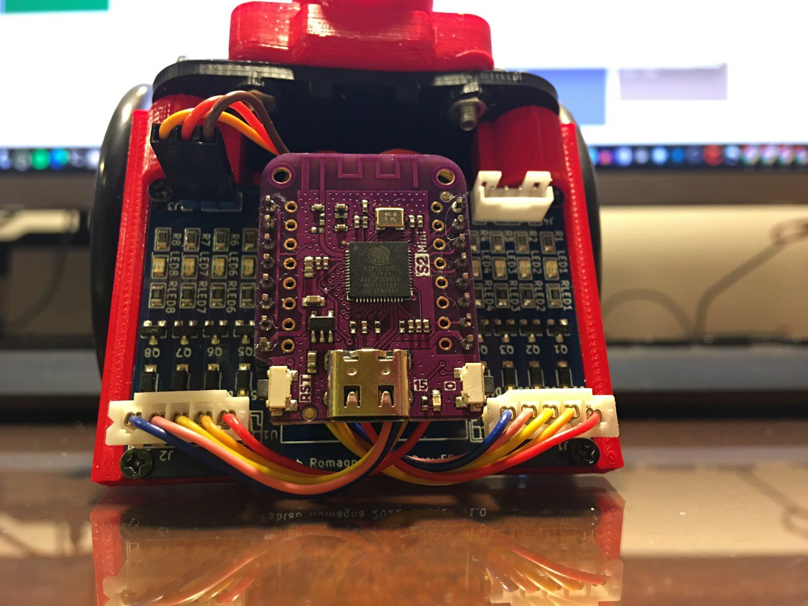

# Draw-ER
### da un'idea originale di [MakersBox](https://www.instructables.com/Arduino-Drawing-Robot/)
Un piccolo, lento ma economico robot disegnatore, autocostruibile da tutti e programmabile in Python per insegnare il coding in modo divertente.

# Eccolo

## stampa la locandina da tenere in classe

## istruzioni per il montaggio

<a href="https://cutt.ly/montaggio-Draw-ER">link al documento GDocs</a>

#### Ci serve un fornitore per queste viti... ci date una mano?

#### questa foto è utile per capire come sono montati i connettori

## usa Kicad per modificare lo schema e il PCB

<a href="https://github.com/fablabromagna-org/Draw-ER/tree/master/File%20Kicad">Kicad</a>

## dai un'occhiata allo schema
<a href="Schematic.pdf">Download PDF</a>
