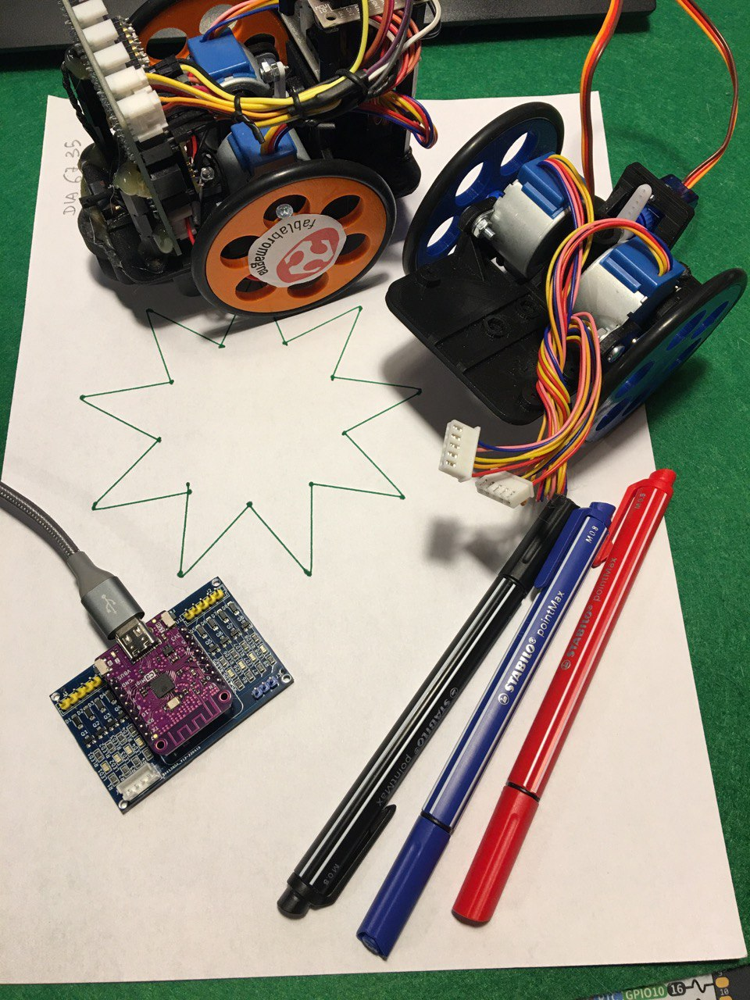
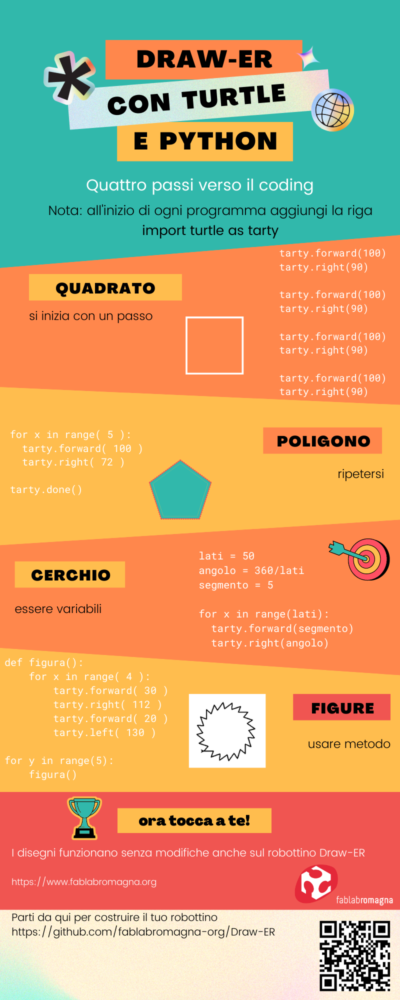

# Draw-ER
### da un'idea originale di [MakersBox](https://www.instructables.com/Arduino-Drawing-Robot/)
Un piccolo, lento ma economico robot disegnatore, autocostruibile da tutti e programmabile in Python per insegnare il coding in modo divertente.

